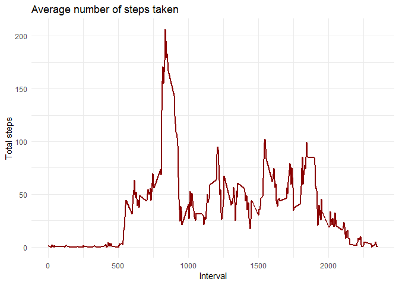
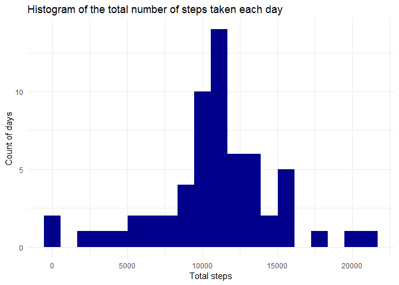

--- 
title: "Coursera Programming Assignment"
author: "Pavel Sonin"
date: "5 April 2019"
output: 
  html_document: 
    keep_md: true 
---

## Please note that assignment tasks are very multivariant, and therefore leave a lot of space for interpretations

Loading the tools


```r
library(ggplot2)
library(dplyr)
```

```
## 
## Attaching package: 'dplyr'
```

```
## The following objects are masked from 'package:stats':
## 
##     filter, lag
```

```
## The following objects are masked from 'package:base':
## 
##     intersect, setdiff, setequal, union
```

```r
library(knitr)
```

```
## Warning: package 'knitr' was built under R version 3.5.3
```

### Downloading data set


```r
furl <- "https://d396qusza40orc.cloudfront.net/repdata%2Fdata%2Factivity.zip"

if (!file.exists("PAds.zip")) {
    download.file(furl,"PAds.zip")
}

if (!file.exists("activity.csv")) {
    unzip("PAds.zip")
}
```

### Loading the data


```r
df <- read.csv("activity.csv")
```

### Working on required analysis

* Histogram of the total number of steps taken each day

Here we need first to summarize a steps by day using dplyr.
For this part of assignment you are allowed to skip NAs.


```r
df1 <- df %>% 
    group_by(date) %>% 
    summarise(total_steps = sum(steps)) %>%
    filter(!is.na(total_steps))

ggplot(data = df1, aes(total_steps))+
    theme_minimal()+
    geom_histogram(bins = 20, fill = "blue4")+
    labs(x = "Total steps", y = "Count of days", title = "Histogram of the total number of steps taken each day")
```

<!-- -->


* Mean and median number of steps taken each day

Calculate and report the mean and median of the total number of steps taken per day


```r
df2 <- df1 %>% 
    summarise(median_steps = median(total_steps), avg_steps = mean(total_steps))
    kable(df2, caption = "mean and median of the total number of steps taken per day") 
```


Table: mean and median of the total number of steps taken per day

 median_steps   avg_steps
-------------  ----------
        10765    10766.19

* Time series plot of the average number of steps taken

Make a time series plot (i.e. type = "l") of the 5-minute interval (x-axis) and the average number of steps taken, averaged across all days (y-axis).

Grouping and summarizing steps by interval and building time series plot


```r
df2_ <- df %>% 
    filter(!is.na(steps)) %>%
    group_by(interval) %>% 
    summarise(mean_steps = mean(steps)) 

ggplot(data = df2_, aes(x= interval, y = mean_steps))+
    theme_minimal()+
    geom_line(col = "red4", size =1)+
    labs(x= "Interval", y = "Total steps", title = "Average number of steps taken")
```

<!-- -->

* The 5-minute interval that, on average, contains the maximum number of steps

Which 5-minute interval, on average across all the days in the dataset, contains the maximum number of steps?


```r
df3 <- df %>% 
    filter(!is.na(steps)) %>%
    group_by(interval) %>% 
    summarise(mean_steps = mean(steps)) 

msteps <- max(df3$mean_steps)

paste(msteps, " steps, and max interval is ",df3$interval[which.max(df3$mean_steps)])
```

```
## [1] "206.169811320755  steps, and max interval is  835"
```


* Code to describe and show a strategy for imputing missing data

Imputing missing values

Note that there are a number of days/intervals where there are missing values (coded as NA). The presence of missing days may introduce bias into some calculations or summaries of the data.

Calculate and report the total number of missing values in the dataset (i.e. the total number of rows with NAs)


```r
sum(is.na(df$steps))
```

```
## [1] 2304
```

Devise a strategy for filling in all of the missing values in the dataset. The strategy does not need to be sophisticated. For example, you could use the mean/median for that day, or the mean for that 5-minute interval, etc.
    Create a new dataset that is equal to the original dataset but with the missing data filled in.

Strategy to fill NAs will be using intervals, since there much more intervals than days, and to use mean.

Let's create a new data set and fill NAs there.

Data set will be called dfA. We will use simple cycle to fill NAs


```r
## calculating means per interval

dfmi <- df %>% 
    filter(!is.na(steps)) %>%
    group_by(interval) %>%
    summarise(mean_steps = mean(steps))

## creating a new dataframe

dfA <- df

## adding mean values for NAs indices

for (i in 1:nrow(dfA)){
    if(is.na(dfA[i,1])){
        dfA[i,1] <- dfmi[(dfA[i,3] == dfmi[,1]),2]
    }
}
```


Make a histogram of the total number of steps taken each day and Calculate and report the mean and median total number of steps taken per day. 


```r
df4 <- dfA %>% 
    group_by(date) %>% 
    summarise(total_steps = sum(steps)) 

ggplot(data = df4, aes(total_steps))+
    theme_minimal()+
    geom_histogram(bins = 20, fill = "blue4")+
    labs(x = "Total steps", y = "Count of days", title = "Histogram of the total number of steps taken each day")
```

<!-- -->

```r
df5 <- df4 %>% 
    summarise(median_steps = median(total_steps), avg_steps = mean(total_steps))
    print(df5)
```

```
## # A tibble: 1 x 2
##   median_steps avg_steps
##          <dbl>     <dbl>
## 1       10766.    10766.
```

Do these values differ from the estimates from the first part of the assignment? What is the impact of imputing missing data on the estimates of the total daily number of steps?


```r
kable(df5 - df2, caption = "Difference with imputed data")
```


Table: Difference with imputed data

 median_steps   avg_steps
-------------  ----------
     1.188679           0

We can see that both median and mean are almost the same, once we filled NAs.

* Are there differences in activity patterns between weekdays and weekends?

For this part the weekdays() function may be of some help here. Use the dataset with the filled-in missing values for this part.

Create a new factor variable in the dataset with two levels – “weekday” and “weekend” indicating whether a given date is a weekday or weekend day.


```r
library(lubridate)
```

```
## 
## Attaching package: 'lubridate'
```

```
## The following object is masked from 'package:base':
## 
##     date
```

```r
dfA$date <- ymd(dfA$date)

dfA <- dfA %>%
    mutate(wday = weekdays(date))

for (i in 1:nrow(dfA)){
    if((dfA[i,4] == "âîñêðåñåíüå") | (dfA[i,4] == "ñóááîòà") ){
        dfA[i,4] <- "weekends"
    } else {
        dfA[i,4] <- "weekdays"
    }
}

dfA$wday <- as.factor(dfA$wday)
```

Make a panel plot containing a time series plot (i.e. type = "l") of the 5-minute interval (x-axis) and the average number of steps taken, averaged across all weekday days or weekend days (y-axis). 


```r
df6 <- dfA %>% 
    group_by(wday, interval) %>% 
    summarise(mean_steps = mean(steps)) 

ggplot(data = df6, aes(x= interval, y = mean_steps))+
    theme_minimal()+
    facet_wrap(~ wday)+
    geom_line(col = "red4", size =1)+
    labs(x= "Interval", y = "Total steps", title = "Average number of steps taken")
```

<!-- -->


